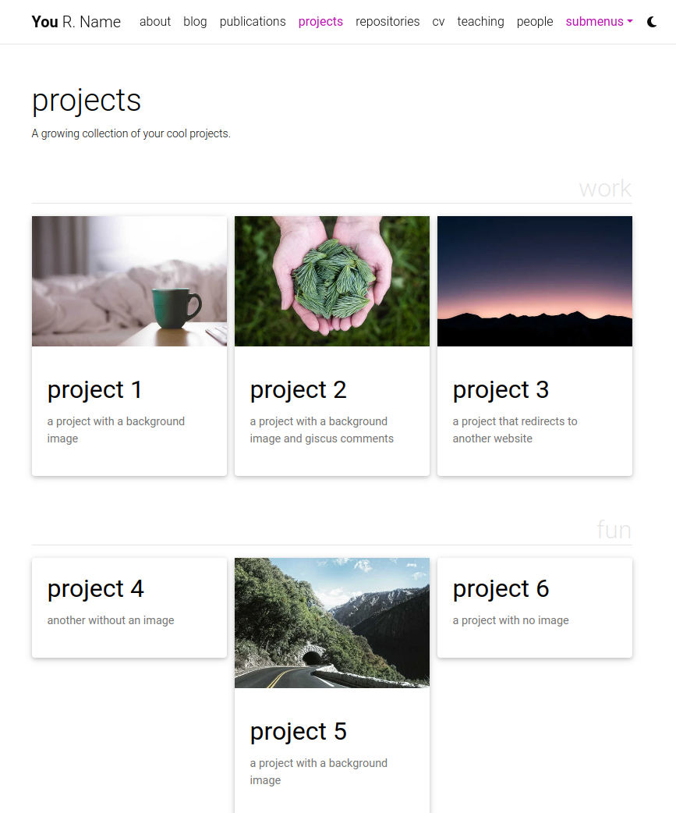

The homepage of Materials Informatics Lab at the University of Arizona. 

## Installing and Deploying

For installation and deployment details please refer to [INSTALL.md](INSTALL.md).

## Customizing

For customization details please refer to [CUSTOMIZE.md](CUSTOMIZE.md).

## Features

### Light/Dark Mode

This template has a built-in light/dark mode. It detects the user preferred color scheme and automatically switches to it. You can also manually switch between light and dark mode by clicking on the sun/moon icon in the top right corner of the page.

---

### People

Profiles currently use project template and are stored in _projects. 

---

### Collections

This Jekyll theme implements `collections` to let you break up your work into categories. The theme comes with two default collections: `news` and `projects`. Items from the `news` collection are automatically displayed on the home page. Items from the `projects` collection are displayed on a responsive grid on projects page.

You can easily create your own collections, apps, short stories, courses, or whatever your creative work is. To do this, edit the collections in the [\_config.yml](_config.yml) file, create a corresponding folder, and create a landing page for your collection, similar to `_pages/projects.md`.

---

### Layouts

**al-folio** comes with stylish layouts for pages and blog posts.

#### The iconic style of Distill

The theme allows you to create blog posts in the [distill.pub](https://distill.pub/) style:

For more details on how to create distill-styled posts using `<d-*>` tags, please refer to [the example](https://alshedivat.github.io/al-folio/blog/2021/distill/).

#### Full support for math & code

**al-folio** supports fast math typesetting through [MathJax](https://www.mathjax.org/) and code syntax highlighting using [GitHub style](https://github.com/jwarby/jekyll-pygments-themes). Also supports [chartjs charts](https://www.chartjs.org/), [mermaid diagrams](https://mermaid-js.github.io/mermaid/#/), and [TikZ figures](https://tikzjax.com/).

#### Photos, Audio, Video and more

Photo formatting is made simple using [Bootstrap's grid system](https://getbootstrap.com/docs/4.4/layout/grid/). Easily create beautiful grids within your blog posts and project pages, also with support for [video](https://alshedivat.github.io/al-folio/blog/2023/videos/) and [audio](https://alshedivat.github.io/al-folio/blog/2023/audios/) embeds:

  

---

### Other features

---

#### Theming

A variety of beautiful theme colors have been selected for you to choose from. The default is purple, but you can quickly change it by editing the `--global-theme-color` variable in the `_sass/_themes.scss` file. Other color variables are listed there as well. The stock theme color options available can be found at [\_sass/\_variables.scss](_sass/_variables.scss). You can also add your own colors to this file assigning each a name for ease of use across the template.

---

#### Social media previews

**al-folio** supports preview images on social media. To enable this functionality you will need to set `serve_og_meta` to `true` in your [\_config.yml](_config.yml). Once you have done so, all your site's pages will include Open Graph data in the HTML head element.

You will then need to configure what image to display in your site's social media previews. This can be configured on a per-page basis, by setting the `og_image` page variable. If for an individual page this variable is not set, then the theme will fall back to a site-wide `og_image` variable, configurable in your [\_config.yml](_config.yml). In both the page-specific and site-wide cases, the `og_image` variable needs to hold the URL for the image you wish to display in social media previews.

---

## FAQ

For frequently asked questions, please refer to [FAQ.md](FAQ.md).

## License

The theme is available as open source under the terms of the [MIT License](https://github.com/alshedivat/al-folio/blob/master/LICENSE).

Originally, **al-folio** was based on the [\*folio theme](https://github.com/bogoli/-folio) (published by [Lia Bogoev](https://liabogoev.com) and under the MIT license). Since then, it got a full re-write of the styles and many additional cool features.
